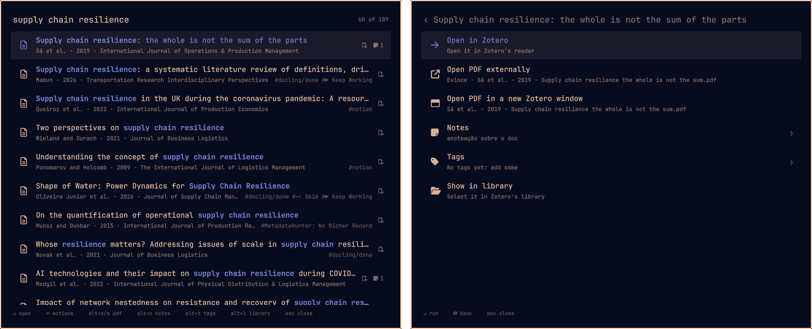

# Zotero Launcher for Omarchy

[](https://github.com/mbradaschia/oma-zotero-launcher/actions/workflows/ci.yml)
[](https://github.com/mbradaschia/oma-zotero-launcher/releases/latest)
[](LICENSE)

**Your whole Zotero library, one keystroke away.** Press **SUPER+SHIFT+Z** anywhere in
[Omarchy](https://omarchy.org), type a few letters, and you're in the paper: its PDF, its notes, its tags,
and Claude, ready to review it, chat about it and quote it with page numbers. All from the keyboard, without
hunting through Zotero's windows.



**At a glance**

| | |
|---|---|
| ⚡ **Instant search** | Fuzzy search over 1,000s of papers as you type, in milliseconds, right inside Zotero |
| 📚 **Everything about a paper** | Its notes, PDF, tags, collections and journal ranking in one menu |
| 🤖 **Claude, grounded in the paper** | Literature reviews, findings and takeaways, and a chat that quotes the paper with page numbers |
| 🏅 **Journal quality at a glance** | ABS, ABDC, FT50 and UTD24 labels on every result |
| ⌨️ **Keyboard first** | One consistent set of keys across every view, numbered rows, no mouse needed |
| 🔒 **Local and private** | Talks only to Zotero on your machine; nothing leaves it unless you ask Claude |

## Features

### Find anything, fast

- **Fuzzy search** over titles, authors, years and tags, ranked like fzf: first authors and whole title
  phrases first. Filters when you need them: `a:smith`, `t:resilience`, `y:2019..2021`, `#tag`, `!exclude`,
  `either | or`.
- **Before you type**, the list is already useful: your pinned papers and collections, the papers open in
  Zotero, then the most recent ones (newest added or changed first).
- **Collections** by their full path ("Topics / SCM / Power"): open one to browse and search its papers,
  subcollections included.
- **Pin** the papers and collections you keep coming back to.
- **Journal rankings** on every result: **ABS** (Chartered ABS *Academic Journal Guide* 2024), **ABDC**
  (*Journal Quality List* 2025), **FT50** and **UTD24**, with the top grades highlighted.

### Get to the paper

- **Jump into Zotero**: its open tab, or its PDF in Zotero's reader, in a Zotero window of its own you can
  tile, or in your own PDF app.
- **Show it in your library**, or select a collection in Zotero's tree.

### Read and reuse your notes

- **Read notes** right in the launcher, nicely typeset, or open one in its **own window** to keep next to
  the PDF, with the paper cited APA 7 style ("Sirmon et al. (2007)"), its journal and ranking.
- **Copy** a note as Markdown, **save** it as a `.md` file, or open it in Zotero's editor, with a key.

### Think with Claude *(needs a Claude subscription)*

- **Prompts** that write notes for you: a complete **Literature Review** and **Findings and Takeaways**
  come included, and you can write your own (model and effort picked from what your Claude account offers).
- **Chat with a paper** in its own window: ask anything, get answers that **quote the paper verbatim with
  APA 7 citations and page numbers**, keep and rename past chats, and save any answer, or the whole chat, to
  Zotero, the clipboard or a file. Start a chat about any paper in your library.
- **Grounded, not guessed**: Claude reads the paper's text, your highlights (with their pages) and your
  notes, and is told never to invent a quote, a page or a reference.
- **Extract the text** of a PDF into a page-numbered note, with the page numbers printed in the journal, so
  quotes cite the right page; choose whether a chat reads that text or the PDF.
- **A task queue** shows what's running and what's done; open the note a task wrote in one keystroke. The
  launcher stays open while Claude works.

### Organize

- **Tags**: add, remove and create them, with Zotero's colors and counts; undoable in Zotero.
- **Pins**, **collections** and the **tasks and chats** entries keep your current work at the top.

### Made for the keyboard

- **One set of keys everywhere**: `Enter` does the main thing, `Shift+Enter` opens in Zotero, `Alt+letter`
  acts (`W` window, `C` copy, `S` save, `P` pin, `N` notes, `T` tags…), `Alt+1…9` picks a numbered row, `Esc`
  goes back.
- **Looks like Omarchy**: it follows your theme, fonts and window rules, and opens from its own keybinding.

### Private by design

- The launcher talks only to Zotero on your computer, through a token only you can read. Your library never
  leaves your machine, except what you send to Claude when you run a prompt or chat (see
  [Privacy and security](#privacy-and-security)).

## Requirements

- [Omarchy](https://omarchy.org) (its shell with plugin support).
- [Zotero 10](https://www.zotero.org).
- For prompts and chat (optional): [Node.js](https://nodejs.org) 22 or newer, and
  [Claude Code](https://docs.claude.com/en/docs/claude-code) logged in with a **Claude subscription**
  (Pro or Max).
- For extracting text: `pdftotext`, from Poppler (`omarchy pkg add poppler` if `pdftotext -v` doesn't run).

## Install

The launcher has three parts: a small **Zotero plugin** (the bridge), the **Omarchy plugin** (the launcher
itself) and, optionally, the **prompt runner**.

### 1. The Zotero bridge

1. Download `oma-zotero-launcher-<version>.xpi` from the
   [latest release](https://github.com/mbradaschia/oma-zotero-launcher/releases/latest).
2. In Zotero: *Tools → Plugins*, then the ⚙ menu → *Install Plugin From File…*, and pick the file.

Zotero keeps it up to date from then on (it checks this repository's releases).

### 2. The Omarchy plugin

```bash
omarchy plugin add https://github.com/mbradaschia/oma-zotero-launcher --enable
```

### 3. The keybinding

Add this to `~/.config/hypr/bindings.lua`, then run `hyprctl reload`:

```lua
o.bind("SUPER + SHIFT + Z", "Zotero launcher", { panel = "io.github.mbradaschia.oma-zotero" })
```

Any free key works; `omarchy-shell shell toggle io.github.mbradaschia.oma-zotero` opens it from a script.

### 4. Prompts, chat and text extraction (optional)

> [!IMPORTANT]
> In this version, prompts and chat run on **Claude only**, through the Claude Agent SDK with your **Claude
> subscription** (the account Claude Code is logged in to). Runs count against your plan's usage.
> Other models and providers are planned; see the [roadmap](#roadmap).

1. Install [Claude Code](https://docs.claude.com/en/docs/claude-code) and log in with your Claude account
   (`claude`, then `/login`).
2. Install the runner from the plugin's folder:
   ```bash
   make -C ~/.config/omarchy/plugins/io.github.mbradaschia.oma-zotero prompts-install
   ```
   It copies the runner to `~/.local/share/oma-zotero-launcher/runner`, installs its packages there, and
   links `~/.local/bin/oma-zotero-prompt`.

### From a checkout (development)

```bash
git clone https://github.com/mbradaschia/oma-zotero-launcher && cd oma-zotero-launcher
make xpi              # dist/oma-zotero-launcher-<version>.xpi, to install in Zotero as above
make install          # copies the Omarchy plugin into ~/.config/omarchy/plugins and enables it
make prompts-install  # optional
```

## Update

- **Zotero bridge**: automatic. To force it: *Tools → Plugins → ⚙ → Check for Updates*.
- **Omarchy plugin**: `omarchy plugin update io.github.mbradaschia.oma-zotero`.
- **Prompt runner**: run the `prompts-install` command again after updating the plugin.

The three parts share one version. The launcher works with an older bridge, but new features may need
the new one: update both.

## Uninstall

```bash
omarchy plugin remove io.github.mbradaschia.oma-zotero
rm -rf ~/.local/bin/oma-zotero-prompt ~/.local/share/oma-zotero-launcher ~/.cache/oma-zotero-launcher
rm -rf ~/.config/omarchy/oma-zotero-launcher ~/.config/omarchy/oma-zotero-launcher.json  # your settings, pins and prompts
```

In Zotero, *Tools → Plugins* → *Omarchy Zotero Bridge* → *Remove*. Remove the keybinding from
`bindings.lua`. Notes the prompts created stay in Zotero (they are tagged `oma-prompt`).

## Usage

### Keys

The same keys mean the same thing everywhere: in the results, inside a collection, in a paper's menus, in
the note reader and in the note window.

| Key | |
|---|---|
| type | search, or filter the list you're in |
| `↑` `↓`, `Ctrl+K` `Ctrl+J`, `PgUp` `PgDn` | move |
| `Enter` (or `Tab`, `→`) | the highlighted row's main action: a paper's menu, into a collection, run, read, choose |
| `Alt+1` … `Alt+9` | the same, on the row with that number (rows show 1–9, counted from the top of what's in view) |
| `Shift+Enter` | open what's highlighted in Zotero: the paper (its tab or PDF), the collection, the note |
| `Alt+W` | a window: a paper's PDF in its own Zotero window, a note in its own window |
| `Alt+C` / `Alt+S` | copy a note as Markdown / save it as a `.md` file in Downloads |
| `Alt+P` | pin or unpin a paper or a collection |
| `Alt+O` / `Alt+N` / `Alt+T` / `Alt+L` | a paper's PDF in your PDF app / its notes / its tags / show it in your library |
| `Alt+E` | edit a prompt |
| `Alt+Q` | the task queue (prompt runs and text extractions), from anywhere |
| `Esc` | clear what you typed, then go back a level; closes the launcher only from the top |
| `Backspace` | with nothing typed: back a level |

Where there's nothing to type (the note reader and the note window), the same letters work without `Alt`:
`z` (like `Shift+Enter`), `w`, `c`, `s`, and `j` `k` scroll. The paper's `Alt` keys work in its menus too,
not just in the results.

### Tasks and chats

Before you type, the results start with **Tasks** and **Chats** (when there are any):

- **Tasks** is the queue of prompt runs and text extractions, running, finished or failed; the footer shows
  how many are running wherever you are, and `Alt+Q` opens it from any list. Running a prompt or extracting
  text keeps the launcher open. `Enter` on a finished task reads the note it made (`Shift+Enter`, `Alt+W`,
  `Alt+C`, `Alt+S` work as on any note); `Esc` comes back to the queue. *Clear finished tasks* forgets them
  (the notes stay in Zotero).
- **Chats** lists your chats with every paper, newest first: `Enter` reopens one in its window. *New chat…*
  asks for the paper (search as usual, `Enter` picks it) and opens a chat about it.

### Search

### Collections

As you type, the best three matching collections are listed first, under **Collections**, by their full path
("_Topics / SCM / Public SCM"; the match can be anywhere in it), then the papers.

| On a collection | |
|---|---|
| `Enter` | open it: its subcollections, then its papers and those of its subcollections, newest first (added or changed); type to search inside it |
| `Shift+Enter` | select it in Zotero's library |
| `Alt+P` | pin it: pinned collections come first before you type, with the pinned papers |
| `Esc`, `Backspace` | (inside it) back to where you were |

Search terms (all must match):

| Term | Matches |
|---|---|
| `resil`, `stev resil` | fuzzy, in titles and authors; first authors and whole title phrases rank higher |
| `a:smith`, `t:resilience` | authors only, title only |
| `2020`, `y:2019..2021` | year (a bare 4-digit term is a year) |
| `#tag` | tag |
| `'exact`, `^prefix`, `suffix$` | exact, prefix and suffix matches |
| `!term` | exclude |
| `a \| b` | either |

### The paper's menu

`Enter` on a paper opens its menu, in sections like the results:

- **Notes**: the paper's notes, newest first (its [extracted text](#extracted-text) among them); see
  [Notes](#notes). `Alt+N` opens them as a list of their own.
- **Prompts and chat**: **Prompts** (see [Prompts](#prompts)), **Chat with the paper** (see
  [Chat with a paper](#chat-with-a-paper)), and the text extraction: **Text not extracted** or **Text
  extracted ✓**; `Enter` extracts it, or extracts it again and replaces the note (see
  [Extracted text](#extracted-text)).
- **This paper**:
  - **Pin to the top** / **Unpin**: pinned papers come first before you type, in a *Pinned* section.
  - **Open in Zotero**: its detail says what it does, such as "Switch to its open tab".
  - **Open PDF externally**, in your default PDF app or `externalPdfCommand`; **Open PDF in a new Zotero
    window**, one you can tile. With several files, you pick one; missing files are listed with the reason.
  - **Tags** (see [Tags](#tags)), **Show in library**.

Type to filter the menu.

### Notes

The paper's notes, newest first. In a list, `Enter` reads one, `Shift+Enter` opens it in Zotero, `Alt+W` in
its own window, `Alt+C` copies it as Markdown and `Alt+S` saves it as a `.md` file in your Downloads folder
(never over an existing file).

While reading, there is nothing to edit, so the same keys work without `Alt`:

| Key | |
|---|---|
| `z`, `Shift+Enter` | open it in Zotero's note editor |
| `w` | open it in its own window |
| `c` / `s` | copy it as Markdown / save it as a `.md` file |
| `↑` `↓` `j` `k`, `Space` `b`, `PgUp` `PgDn`, `g` `G` | scroll |
| `Backspace`, `Esc` | back |

**The note window** is a normal window: tile it, float it, resize it, keep it next to the PDF. Its header
cites the paper APA 7 style, "Sirmon et al. (2007)", with the title, the journal and its rankings; its top
bar has *Menu* (`m`: back to the launcher, on the paper's menu with this note highlighted), *Zotero* (`z`,
`Shift+Enter`), *Copy .md* (`c`) and *Save .md* (`s`). Select text to copy a passage
(`Ctrl+C`).
Close it like any window (SUPER+W) or with its ✕.

Copies and saved files are the note as Zotero's *Export Note → Markdown* gives it.

### Prompts

> [!NOTE]
> Prompts need the optional [prompt runner](#4-prompts-chat-and-text-extraction-optional) and a **Claude subscription**. They run
> on Claude only in this version.

The paper's menu → **Prompts** lists them. `Enter` runs one: Claude reads the paper and its answer is saved
as a new note on it, usually within a few minutes. It runs in the background, the launcher stays open, and the
run shows in [Tasks](#tasks-and-chats) (`Alt+Q`); a notification says when the note is saved.

Two prompts come with it:

- **Literature Review**: overview, research question, theoretical framework, method, findings, contributions,
  limitations and future research, key quotes, connections to your notes.
- **Findings and Takeaways**: the central finding, the key findings with evidence, takeaways, how to cite it,
  key quotes.

Both quote the paper verbatim with APA 7 in-text citations and page numbers, and end with an APA 7 reference
list. Claude is given the paper's APA 7 reference (formatted by Zotero), your highlights and comments with
their pages, your existing notes, and the full text Zotero indexed, and is told never to invent a quote, page
or reference. Still, check quotes against the paper before you cite them.

**Your own prompts.** `Alt+E` on a prompt edits it in the launcher: its title, its **model** and **effort**
(dropdowns listing the models your Claude account offers and the effort levels each supports), and its text,
which opens in your editor. *New prompt…* creates one. Prompts are Markdown files in
`~/.config/omarchy/oma-zotero-launcher/prompts/`:

```markdown
---
title: Methods Critique
model: opus[1m]
effort: high
---
Critique the paper's method: design, sample, measures, analysis. Quote the passages you discuss,
with APA 7 citations and pages, and end with a "## References" section in APA 7.
```

From a terminal: `oma-zotero-prompt list`, `run <prompt> --key <item key>` (`--dry-run` shows what Claude
would get), `new`, `edit <prompt>`, `set <prompt> --model sonnet --effort medium`, `models`. Runs are logged
to `~/.local/state/oma-zotero/prompts.log`.

### Chat with a paper

> [!NOTE]
> Chat needs the optional [prompt runner](#4-prompts-chat-and-text-extraction-optional) and a **Claude
> subscription**. It runs on Claude only in this version.

The paper's menu → **Chat with the paper** opens a chat window: a normal window you can tile next to the PDF.

- **Grounded in the paper.** Claude gets the paper's text (its [extracted text](#extracted-text) when you've
  saved it, page by page; else the PDF, read when you ask), its APA 7 reference, your highlights and your
  notes. Answers quote the paper verbatim with APA 7 citations and page numbers, e.g.
  "(Sirmon et al., 2007, p. 282)", and say when something isn't in it. The line under the top bar says what
  the chat is grounded in; *Extract text* there saves the text first.
- **Extracted or not.** The line under the top bar says whether the paper's text is extracted, with
  *Extract text* when it isn't, and **Ground in: .md / PDF** chooses what new chats read: the extracted text
  (the page-numbered `.md` note) or the PDF, read fresh. A chat keeps the source it started with, so
  switching starts a new chat.
- **Past chats** are in a list on the left, collapsed at first: `☰` shows or hides it. Click one to continue it, and rename it with its ✎
  (or a double-click). Each chat keeps its
  context: follow-up questions build on the earlier answers. Closed chat windows reopen from the paper's
  menu or from **Chats** in the launcher.
- **New chat ▾**: about this paper, or *about another paper…*, which searches your library and switches the
  window to the paper you pick.
- **Outputs.** Under every answer: *Copy* (Markdown), *Save to Zotero* (a note on the paper, tagged
  `oma-chat`) and *Download* (a `.md` file in Downloads). The top bar does the same for the whole chat.
- **Back to the launcher.** *Menu* in the top bar (`Alt+M`) opens the launcher on the paper's menu, with *Chat
  with the paper* highlighted; the chat window stays open.
- **Keys.** `Enter` sends, `Shift+Enter` starts a new line, `Esc` stops an answer (or closes a menu; so does a
  click elsewhere). The model and effort (the button under the question) come from the same list as the
  prompts'.

Chats are kept in `~/.local/state/oma-zotero/chats/`, one folder per paper.

### Extracted text

In the paper's menu, `Enter` on **Text not extracted** saves the PDF's text as a note on the paper, with
`pdftotext`: one section per page, headed with the page number the journal printed on it ("p. 275"), or else
the item's page range, or else the PDF's page numbers. The note is tagged `oma-fulltext`, and it's listed with the
paper's notes. Once it exists, the row reads **Text extracted ✓** with the date; `Enter` then extracts the text
again and replaces the note (the old one goes to Zotero's trash, where you can restore it).

Chats and prompts use this note when it's there, so their quotes carry the right page numbers; without it they
read the PDF each time (and, without `pdftotext` or a PDF, Zotero's own full-text index, which has no page
numbers). A scanned PDF with no text layer can't be extracted. Very long papers are cut to stay within
Zotero's note size (about 240,000 characters).

From a terminal: `oma-zotero-prompt extract --key <item key>` (`--force` extracts again).

### Tags

Every tag in the paper's library: its own tags first and checked, colored tags in their color, how many
papers use each, `auto` on automatic ones. Type to find one, `Enter` adds or removes it; a new name gets a
*Create tag* row (`Ctrl+Enter` adds exactly what you typed). Edits go through Zotero, so *Edit → Undo* in
Zotero reverts them.

### Journal rankings

Papers from ranked journals show labels on the right of the results and in the note window:

- **ABS 1** to **ABS 4\***: the Chartered ABS [*Academic Journal Guide* 2024](https://charteredabs.org/academic-journal-guide/academic-journal-guide-2024).
- **ABDC C** to **ABDC A\***: the Australian Business Deans Council [*Journal Quality List*](https://abdc.edu.au/abdc-journal-quality-list/) (2025).
- **FT50**: the Financial Times research journal list.
- **UTD24**: the UT Dallas list.

Journals are matched by ISSN, else by name or abbreviation. The top grades (ABS 4 and 4\*, ABDC A and A\*,
FT50, UTD24) are highlighted.

## Configuration

`~/.config/omarchy/oma-zotero-launcher.json`; every setting is optional. An invalid setting falls back to its
default, and the launcher's footer names it.

```json
{
  "enterAction": "reader",
  "externalPdfCommand": ["zathura"],
  "maxResults": 60,
  "accelerators": true,
  "emptyQuery": { "showOpen": true, "tabOrder": "mru", "recent": "latest", "recentLimit": 15 },
  "port": 23119,
  "promptCommand": ["oma-zotero-prompt"]
}
```

| Setting | |
|---|---|
| `enterAction` | `"reader"` (default): Shift+Enter opens the paper's PDF in Zotero's reader if it isn't open. `"select"`: it only selects the paper in your library. |
| `externalPdfCommand` | Open PDFs in this app instead of your default one. |
| `maxResults` | Results per search, 10–200 (default 60). |
| `accelerators` | `false` turns off the `Alt` keys in the results. |
| `emptyQuery.showOpen` | List the papers open in Zotero before you type (default `true`). |
| `emptyQuery.tabOrder` | `"mru"`: most recently used first (default); `"tabbar"`: Zotero's tab order. |
| `emptyQuery.recent` | Then the most recent papers: `"latest"` (default; each paper by the newer of when it was added and when it was last changed), `"added"`, `"modified"`, or `"none"`. |
| `emptyQuery.recentLimit` | How many of those, 0–50 (default 15). |
| `port` | Zotero's HTTP port, if you changed it (default 23119). |
| `promptCommand` | How to start the prompt runner if `oma-zotero-prompt` isn't on your `PATH`. |

### Files

| Path | |
|---|---|
| `~/.config/omarchy/oma-zotero-launcher.json` | settings |
| `~/.config/omarchy/oma-zotero-launcher/pins.json` | pinned papers and collections |
| `~/.config/omarchy/oma-zotero-launcher/prompts/` | your prompts |
| `~/.local/share/oma-zotero-launcher/runner/` | the prompt runner |
| `~/.cache/oma-zotero-launcher/models.json` | Claude's model list, refreshed daily |
| `~/.local/state/oma-zotero/prompts.log` | prompt, chat and extraction runs |
| `~/.local/state/oma-zotero/chats/` | chats, one folder per paper |
| `~/.local/state/oma-zotero/tasks/` | the task queue (`tasks.json` is its index) |
| `$XDG_RUNTIME_DIR/oma-zotero/bridge.json` | the bridge's port and token (0600) |

## Privacy and security

- The bridge adds routes under `/oma-zotero/` to Zotero's own local HTTP server (127.0.0.1). Every request
  needs a token only your user can read, and requests from web pages are refused.
- The launcher changes your library only when you ask it to: tags, and notes the prompts create.
- **Prompts and chat send data to Anthropic**: when you run a prompt or ask a question, the paper's
  metadata, text, your highlights and your notes on it go to Claude through Claude Code, under your Claude
  account's terms. Nothing else leaves your machine; extracting text is local.

## Troubleshooting

| The launcher says | |
|---|---|
| *The Zotero bridge isn't installed* | Install the `.xpi` ([step 1](#1-the-zotero-bridge)), or restart Zotero after installing it. |
| *Zotero isn't running* | Press `Enter` to start it. |
| *Zotero rejected the bridge token* | Restart Zotero. |
| *oma-zotero-prompt isn't installed* | Run the [prompt runner install](#4-prompts-chat-and-text-extraction-optional). |
| *pdftotext isn't installed* | `omarchy pkg add poppler` |
| *the PDF has no text layer* | It's a scan: run OCR on it first (for example `ocrmypdf`), then extract again. |

A prompt that fails says why in a notification; `~/.local/state/oma-zotero/prompts.log` has the details. If
it's a login or usage-limit problem, check `claude` in a terminal.

## Development

```bash
make help         # every target
make test         # unit tests (Node)
make lint         # JavaScript, QML and shell syntax
make bridge-link  # load zotero-bridge/ unpacked into Zotero (quit Zotero first), with dev routes
make bridge-reload  # reload the bridge's code without restarting Zotero
make dev          # sync the Omarchy plugin on every change (QML changes: make plugin-reload)
make e2e          # end-to-end, in the live shell and Zotero
```

The live tests (`make e2e`, `make smoke`, `make fresh-install`) put everything back: Zotero's tabs and
selection, your focused window, the clipboard, settings and your installed plugin. The launcher takes the
keyboard while they run, so don't type. Only `make e2e-write` and `make smoke-write` edit your library: they
add and remove the tag `oma-zotero-test` on one paper.

| Path | |
|---|---|
| `ZoteroSearch.qml`, `NoteWindow.qml`, `Service.qml`, `lib/` | the Omarchy plugin |
| `zotero-bridge/` | the Zotero plugin (built into the `.xpi`) |
| `ChatWindow.qml` | the chat window |
| `daemon/` | the prompt runner (`oma-zotero-prompt`, Claude Agent SDK): prompts, chat, text extraction |
| `scripts/` | build, release, rankings update and live tests |
| `tests/` | unit tests |

`PLAN.md` has the design; `spikes/` the measurements behind it.

## Releases and versioning

The project follows [Semantic Versioning](https://semver.org): the Omarchy plugin, the Zotero bridge and the
prompt runner share one version (`make version`). Changes are listed in [CHANGELOG.md](CHANGELOG.md).

To release, add the changes under *[Unreleased]* in the changelog, then on `master`:

```bash
make release VERSION=1.2.0
git push origin master v1.2.0
```

`make release` sets the version everywhere, dates the changelog, runs the tests, builds the `.xpi` and
`zotero-bridge/updates.json`, commits and tags. The pushed tag runs the [release workflow](.github/workflows/release.yml),
which rebuilds the `.xpi` from the tag, checks it is byte-identical to the one `updates.json` describes (the
build is reproducible), and publishes the GitHub release with the `.xpi`, its SHA-256 and the changelog
notes. Installed bridges then update themselves, and `omarchy plugin update` brings the launcher to `master`.

The journal lists come with the bridge: `scripts/update-rankings.sh` downloads them again.

## Roadmap

- **More models for prompts and chat** ([the plan](PLAN-providers.md)): OpenAI, Gemini, OpenRouter, Ollama and any
  OpenAI-compatible endpoint, the ChatGPT subscription, and a settings editor in sections to configure them.
  They run on Claude only today. Other providers (OpenAI and other APIs, local
  models) are planned behind the same prompt files.
- Tag papers in Zotero with their journal rankings.

## Credits

- Journal rankings: the Chartered Association of Business Schools' *Academic Journal Guide* 2024, the
  Financial Times research list (FT50) and the UT Dallas list (UTD24), from the snapshots in
  [wosaide-journal-lists](https://github.com/wosaide/wosaide-journal-lists); the Australian Business Deans
  Council's [*Journal Quality List*](https://abdc.edu.au/abdc-journal-quality-list/), from its official
  workbook. The lists remain their publishers'.
- Built on [Zotero](https://www.zotero.org), [Omarchy](https://omarchy.org) and its
  [Quickshell](https://quickshell.org) shell, and the
  [Claude Agent SDK](https://docs.claude.com/en/api/agent-sdk/overview).

## License

[MIT](LICENSE)
